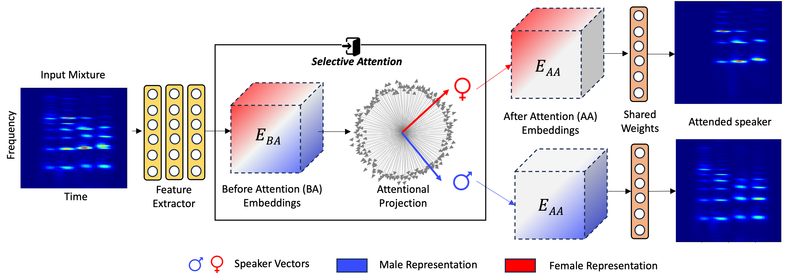

# EMMA-Ferret
Single stream EMMA framework used for Ferret Stimuli Analysis. For detailed experiments and insights please read our [article](https://www.biorxiv.org/content/biorxiv/early/2024/06/11/2024.05.21.595171.full.pdf)

## Introduction
This repository implements a computational model inspired by the Explicit Memory Multi-resolution Adaptive (EMMA) framework for speech segregation. The model is designed to explore and provide a framework for understanding the role of temporal coherence in segregating complex auditory scenes, as observed in biological experiments.




## Overview
The model aims to segregate a target voice from a mixture of voices by incorporating a directive or attentional focus, similar to how ferrets were trained to direct their attention to a specific voice. The model leverages two key principles to achieve this:

High-dimensional Nonlinear Mapping:
The input voice mixture is mapped to a nonlinear high-dimensional space, simulating the diverse selectivity of cortical neurons to attributes like frequency, pitch, and location. This stage is implemented using deep-learning neural embeddings referred to as pre-attentional model embeddings (Mp), which capture all the characteristics of the input mixture.

Attentional Focus for Voice Segregation:
The attentional focus stage (Ma) selectively enhances the representation of the attended target voice while suppressing other competing sources. This is achieved by aligning the Mp embeddings based on their temporal coherence with the target voice. This stage enables the model to gate the Mp embeddings in a way that emphasizes the target voice features, allowing for successful segregation.

## Usage
To run this code, follow these steps:
1. Clone the repository.
2. Create a new conda env using the environment.yml and set path varaibles in dataloader.py.
3. Set wandb_api_key in script train_model.py and run.
4. For analysis scripts refer to the folder 'analysis'

For pre trained model checkpoints and stimuli data please reach out to Karan Thakkar (kthakka2@jhu.edu)

## References

```@article{bellur2023explicit,
  title={Explicit-memory multiresolution adaptive framework for speech and music separation},
  author={Bellur, Ashwin and Thakkar, Karan and Elhilali, Mounya},
  journal={EURASIP Journal on Audio, Speech, and Music Processing},
  volume={2023},
  number={1},
  pages={20},
  year={2023},
  publisher={Springer}
}
```

```@article{joshi2024temporal,
  title={Temporal Coherence Shapes Cortical Responses to Speech Mixtures in a Ferret Cocktail Party},
  author={Joshi, Neha and Ng, Yu and Thakkar, Karran and Duque, Daniel and Yin, Pingbo and Fritz, Jonathan and Elhilali, Mounya and Shamma, Shihab},
  journal={bioRxiv},
  pages={2024--05},
  year={2024},
  publisher={Cold Spring Harbor Laboratory}
}
```